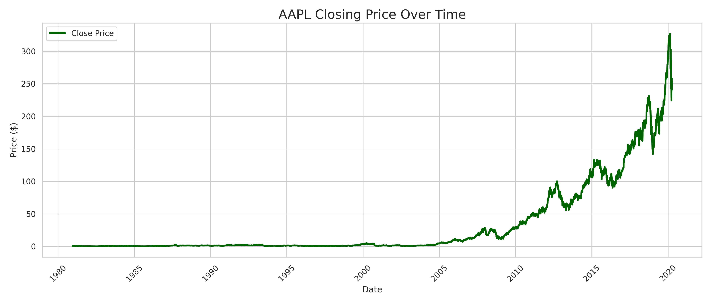
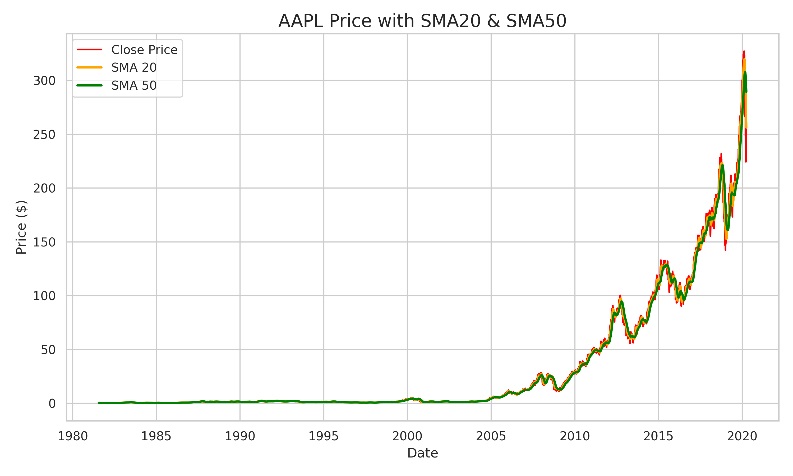
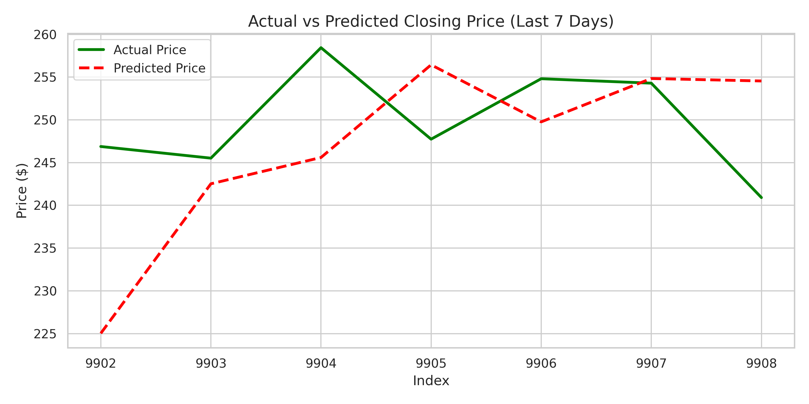
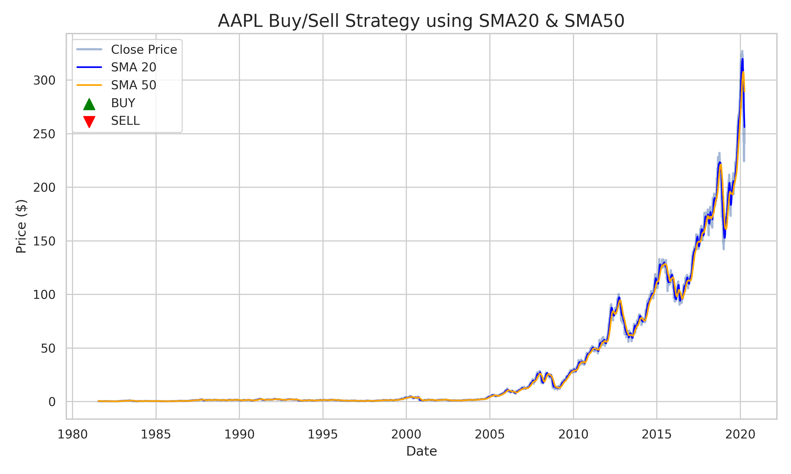

# 📈 Task 2 – Stock Price Prediction with Buy/Sell Strategy

✅ Completed as part of the Machine Learning Internship at **Future Interns**

---

## 📊 Dataset
- **Source**: [Stock Market Dataset]([https://www.kaggle.com/datasets/jacksoncrow/stock-market-dataset](https://www.kaggle.com/datasets/jacksoncrow/stock-market-dataset))
- Used historical stock data for **AAPL (Apple Inc.)**

---

## 🎯 Objective
Build a machine learning model to predict short-term stock price trends using Linear Regression and generate trading strategy signals using SMA crossovers.

---

## 🧠 What I Did

1. **Data Preprocessing**
   - Cleaned and visualized AAPL price trends
   - Added SMA20 and SMA50 moving averages

2. **Model Implementation**
   - Created lag features (previous 7 days of prices)
   - Trained a **Linear Regression** model
   - Predicted the next 7 days of stock prices

3. **Evaluation**
   - Metrics used:  
     - MAE: `9.37`  
     - RMSE: `11.58`  
     - MAPE: `3.77`

4. **Strategy Logic**
   - Buy when SMA20 **>** SMA50  
   - Sell when SMA20 **<** SMA50  
   - Plotted signals on price chart

---

## 📸 Visuals

### Closing Price  

### SMA20 + SMA50  

### Actual vs Predicted  

### Buy/Sell Signals  

---

## 💡 Business Insight

- SMA crossovers help traders identify **entry and exit** points
- Short-term predictions assist in **portfolio timing**
- Combined ML + rule-based logic for real-world use

---

## 🚀 Future Improvements

- Add RSI/MACD indicators for deeper strategy  
- Try other models (LSTM, XGBoost) for accuracy  
- Deploy via Streamlit dashboard  
- Backtest strategy for profit simulation

---
